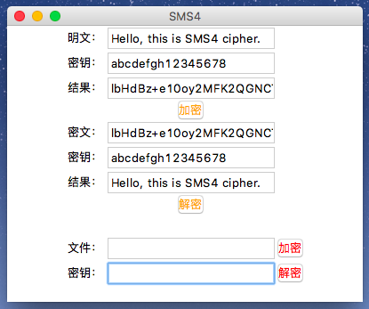
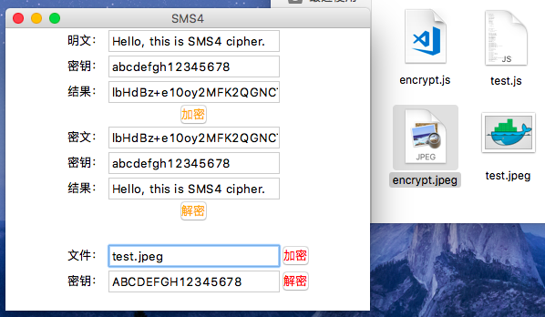
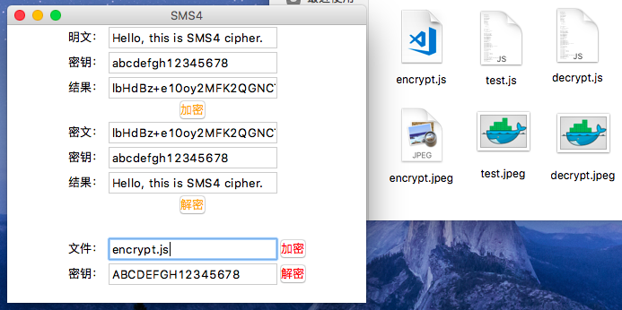

## SMS4 加解密的 Python 实现

### 环境

1. 使用的 Python 版本是：Python 3.6.3。
2. 无使用其他第三方库，根据密码学实验要求纯手工实现。

### 使用

**加密文字**

在得到的项目文件夹下使用如下命令即可启动 GUI 界面，输入待加密明文和密钥后，点击加密/解密按钮即可：

```Python
$ python3 main.py
```

**注意事项：**

* SMS4 是国家商用分组密码，明文和密文分组的长度都是128位，也就是16字节。
* 密钥要求也128位，本项目密钥输入框只能输入16字节 ASCII 字符，不足时会提示错误。
* 输入明文不用在意个数，如果字符不是128位的整数倍时，会对位进行填充。
* 加密结果会用 Base64 进行编码，以达到密文可视的效果。



**加密文件**

将需要加密的文件放到 main.py 同一目录下后，输入文件名称和密钥，点击加密按钮即可得到加密后的文件：



输入加密后的文件名称，点击解密按钮即可解密文件：



### 拓展

参考 operation.py 和 sms4.py 文件，可对其功能进行拓展。